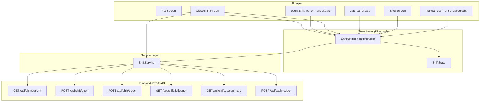
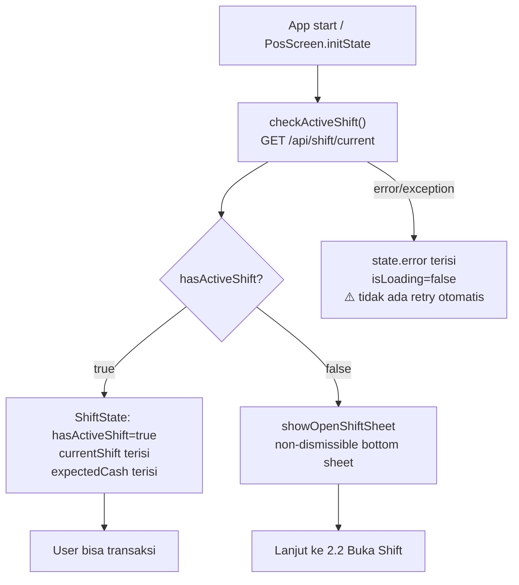
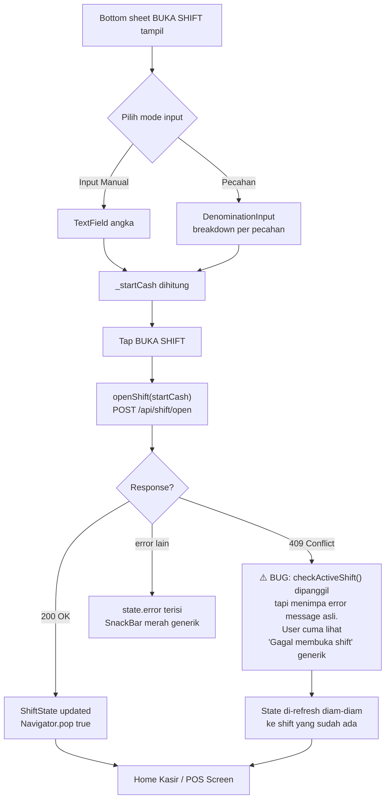
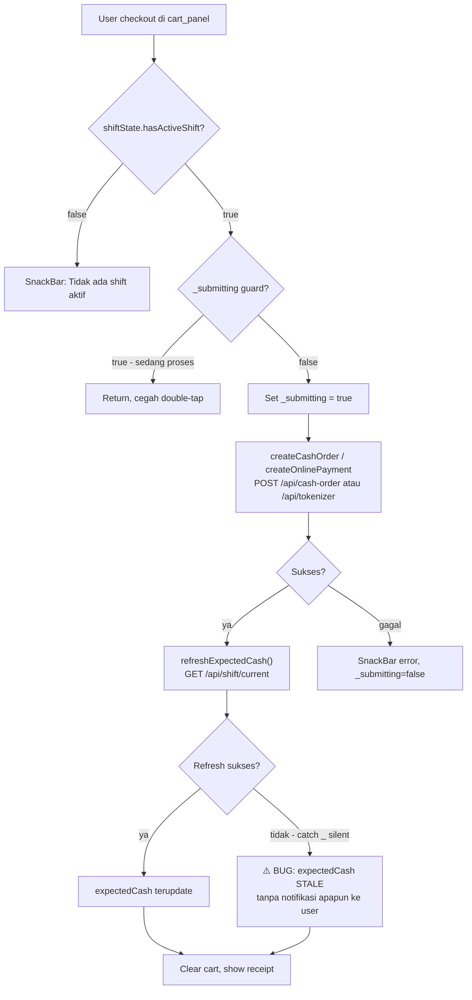
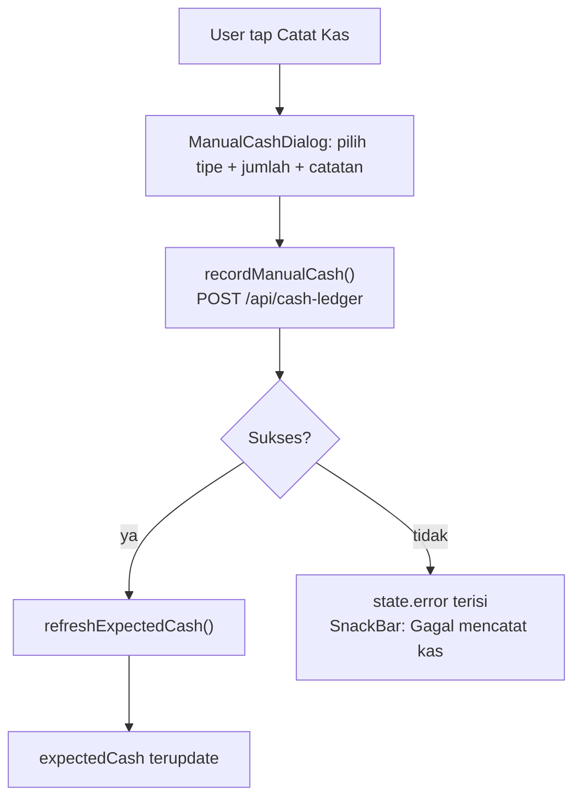
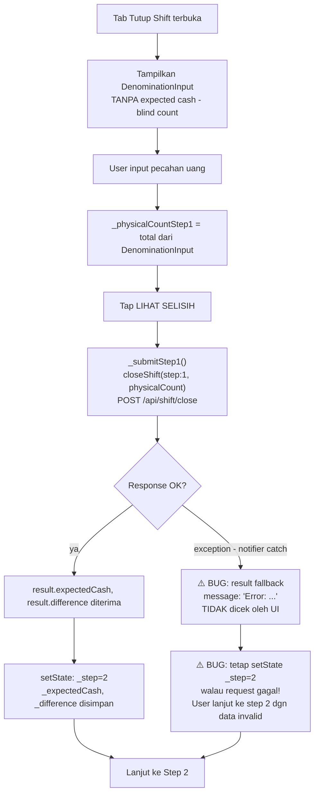
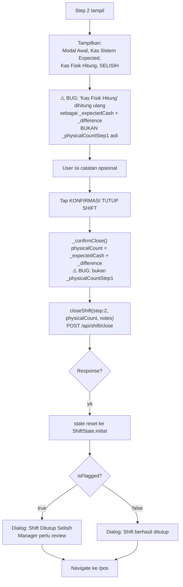
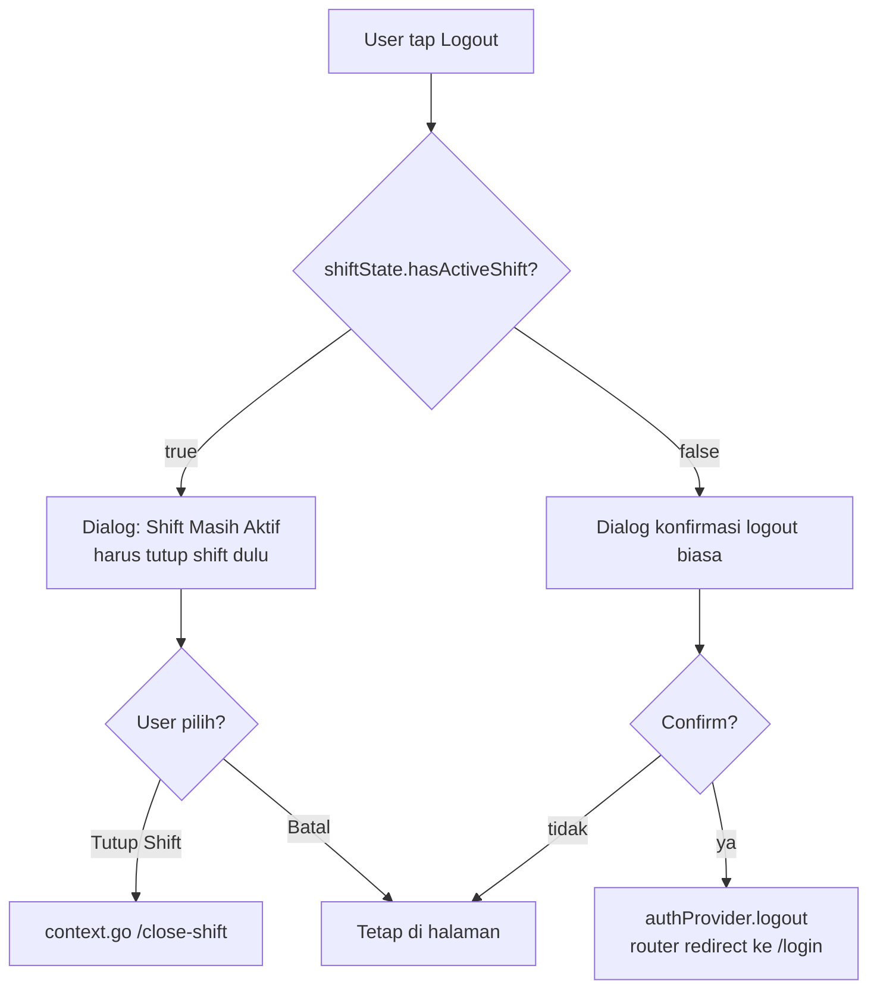
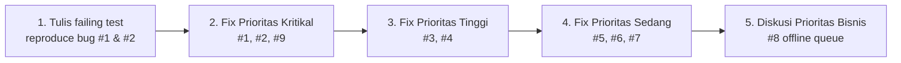

# Shift System — Audit, Flow, & Rencana Perbaikan

**Status**: Prioritas Kritikal, Tinggi, dan Sedang sudah dieksekusi & lulus test (lihat §6). Prioritas Rendah (#7) sudah selesai. Offline queue (#8) masih menunggu keputusan bisnis.
**Terkait**: `Docs/plan/flutter-shift-cash-algorithms.md` (spec awal, 2026-08-11)
**File kode relevan**:
- `lib/models/shift.dart`
- `lib/models/cash_ledger_entry.dart`
- `lib/providers/shift_provider.dart`
- `lib/services/shift_service.dart`
- `lib/screens/close_shift_screen.dart`
- `lib/screens/widgets/open_shift_bottom_sheet.dart`
- `lib/screens/pos_screen.dart` (boot check)
- `lib/screens/shell_screen.dart` (nav guard)
- `lib/screens/widgets/cart_panel.dart` (payment guard)
- `lib/screens/widgets/manual_cash_entry_dialog.dart`

---

## 1. Arsitektur Saat Ini

**Catatan arsitektur:**
- Tidak ada persistensi lokal (Hive/Isar/SQLite) — semua state shift hilang saat app di-kill sebelum refresh berikutnya. Server jadi satu-satunya source of truth.
- Tidak ada offline queue meski didesain di dokumen spec awal (`flutter-shift-cash-algorithms.md` §7-8).
- `shiftServiceProvider` dideklarasikan dua kali (duplikat, lihat §4.6).

---

## 2. Flowchart per Proses

### 2.1 Boot & Cek Shift Aktif (App Start)

### 2.2 Buka Shift

### 2.3 Transaksi Selama Shift Aktif (Cash / Online Payment)

### 2.4 Catat Kas Manual (Cash In/Out)

### 2.5 Tutup Shift — Step 1: Hitung Fisik (Blind Count)

### 2.6 Tutup Shift — Step 2: Review & Konfirmasi

**Root cause bug #2.6:** `_physicalCountStep1` disimpan di state widget tapi tidak pernah dipakai lagi setelah step 1. Step 2 merekonstruksi angka dari response server (`_expectedCash + _difference`) alih-alih mengirim ulang nilai hitung fisik yang otentik. Kalau backend menerapkan pembulatan/toleransi pada `difference`, nilai yang dikonfirmasi di step 2 **berbeda** dari yang benar-benar dihitung kasir — dan itulah nilai yang tersimpan permanen di ledger.

### 2.7 Logout dengan Shift Aktif

---

## 3. Ringkasan Bug (untuk referensi cepat)

| # | Bug | Lokasi | Dampak | Prioritas |
|---|-----|--------|--------|-----------|
| 1 | Step 2 kirim `physicalCount` hasil rekonstruksi, bukan nilai hitung fisik asli | `close_shift_screen.dart:94-95` | Korupsi data audit kas — nilai fisik tersimpan bisa beda dari kenyataan | **Kritikal** |
| 2 | Step 1 tidak cek error sebelum lanjut ke step 2 | `close_shift_screen.dart:82-92` | User lanjut ke step 2 dengan data invalid tanpa tahu | **Kritikal** |
| 3 | `ShiftCloseResult.message` tidak pernah ditampilkan | model + `close_shift_screen.dart` | Pesan error/warning dari backend hilang | Tinggi |
| 4 | `refreshExpectedCash()` menelan semua error (`catch (_) {}`) | `shift_provider.dart:138-147` | expectedCash stale tanpa notifikasi, mempengaruhi rekonsiliasi | Tinggi |
| 5 | 409 saat buka shift menimpa pesan error asli | `shift_provider.dart:90-98` | User bingung kenapa "gagal" padahal shift sudah ada | Sedang |
| 6 | Tidak ada guard anti-double-submit di `ShiftNotifier` | `shift_provider.dart` (semua method async) | Request duplikat dari tap ganda/network lambat | Sedang |
| 7 | Duplikasi deklarasi `shiftServiceProvider` | `shift_provider.dart:6` & `shift_service.dart:6` | Jebakan maintenance, potensi instance provider berbeda | Rendah |
| 8 | Offline queue di spec dokumen tidak pernah diimplementasi | N/A (missing) | Transaksi gagal total saat network putus, bukan diantrikan | Perlu keputusan bisnis |
| 9 | Tidak ada test coverage untuk shift sama sekali | `test/unit/`, `test/widget/` | Regresi bug di atas tidak akan terdeteksi otomatis | Kritikal (proses) |

---

## 4. Rencana Perbaikan

### 4.0 Urutan Eksekusi

### 4.1 [Kritikal] Perbaiki payload step 2 close-shift

**File**: `lib/screens/close_shift_screen.dart`, `lib/providers/shift_provider.dart`

- `_confirmClose()` harus mengirim `_physicalCountStep1` (nilai asli hasil hitung fisik dari step 1) sebagai `physicalCount`, **bukan** `_expectedCash + _difference`.
- `_buildStep2()` — baris `_reviewRow('Kas Fisik (Hitung)', ...)` harus menampilkan `_physicalCountStep1` apa adanya, bukan hasil rekonstruksi.
- `_physicalCountStep1` sudah ada sebagai field di state widget — cukup dipakai ulang, tidak perlu perubahan model.

### 4.2 [Kritikal] Validasi hasil step 1 sebelum lanjut ke step 2

**File**: `lib/screens/close_shift_screen.dart`

- Tambah flag error/success eksplisit di `ShiftCloseResult` (atau deteksi lewat `shiftProvider.error` setelah call).
- `_submitStep1()` hanya `setState(_step = 2)` jika request benar-benar sukses. Kalau gagal, tampilkan error (lihat 4.3) dan tetap di step 1.

### 4.3 [Tinggi] Tampilkan `message` dari server, hentikan silent-fail

**File**: `lib/screens/close_shift_screen.dart`, `lib/providers/shift_provider.dart`

- Render `result.message` sebagai banner/snackbar kalau tidak kosong, khususnya saat step 1.
- Terapkan pola sama di flow lain yang punya field message dari server tapi tidak ditampilkan.

### 4.4 [Tinggi] `refreshExpectedCash()` jangan menelan error diam-diam

**File**: `lib/providers/shift_provider.dart:138-147`

- Ganti `catch (_) {}` dengan set `state.copyWith(error: ...)` atau flag `refreshFailed` khusus.
- Tampilkan indikator kecil di UI (mis. badge "Kas belum ter-update, tarik untuk refresh") di `pos_screen.dart` / `close_shift_screen.dart`.
- Tambahkan retry otomatis 1x sebelum menyerah.

### 4.5 [Sedang] Perbaiki UX error 409 saat buka shift

**File**: `lib/providers/shift_provider.dart:90-98`

- Saat 409, tampilkan pesan spesifik ("Shift sudah aktif, memuat ulang...") **sebelum** memanggil `checkActiveShift()` yang menimpa `state.error`.

### 4.6 [Sedang] Guard anti-double-submit di `ShiftNotifier`

**File**: `lib/providers/shift_provider.dart`

- Tambah `bool _busy` internal, pola sama seperti `_submitting` di `cart_panel.dart`, untuk `openShift`, `closeShift`, `recordManualCash`.

### 4.7 [Rendah] Konsolidasi provider duplikat

**File**: `lib/providers/shift_provider.dart:6`, `lib/services/shift_service.dart:6`

- Hapus salah satu deklarasi `shiftServiceProvider` (idealnya disimpan di `shift_service.dart` karena itu file service-nya). Update import di file lain yang bergantung.

### 4.8 [Perlu keputusan bisnis] Offline queue untuk transaksi shift

**File baru**: kemungkinan `lib/services/offline_queue_service.dart` + storage (Hive/Isar, atau `shared_preferences` untuk versi ringan)

- Sesuai `Docs/plan/flutter-shift-cash-algorithms.md` §7-8, kalau lokasi penggunaan app memang punya konektivitas tidak stabil, implementasikan queue lokal untuk transaksi cash/cash-ledger yang gagal karena network, dengan sinkronisasi otomatis saat online kembali.
- **Perlu konfirmasi kebutuhan bisnis dulu** sebelum masuk scope — ini effort besar (state management tambahan, konflik data, UI indikator offline).

### 4.9 [Kritikal - proses] Test coverage untuk shift

**File baru**:
- `test/unit/shift/shift_notifier_test.dart` — cover: open shift sukses/gagal/409, close shift step1→step2 dengan payload benar (regression test untuk 4.1), refreshExpectedCash gagal, recordManualCash.
- `test/widget/shift/close_shift_screen_test.dart` — step 1→2 transition, error display, payload yang dikirim ke service saat step 2.
- `test/widget/shift/open_shift_bottom_sheet_test.dart` — input manual vs pecahan, error 409.

**Rekomendasi**: tulis test ini **sebelum** melakukan fix 4.1 dan 4.2, supaya bug ter-reproduce sebagai failing test dulu, baru fix sampai hijau. Ini juga menjadi regression guard permanen.

---

## 5. Catatan Implementasi Optimal (Prinsip Umum)

1. **Single source of truth untuk physical count** — jangan pernah merekonstruksi nilai input user dari response server. Simpan nilai asli di state dan pakai ulang di semua langkah berikutnya.
2. **Tidak ada silent catch** — setiap `catch` yang menelan error tanpa aksi (baik state update maupun user feedback) adalah bug laten. Minimal set error state, idealnya juga log ke observability tool (mis. Sentry — project ini sudah punya skill `sentry-flutter-sdk`, pertimbangkan integrasi untuk shift-critical errors).
3. **Idempotency di level UI** — semua tombol yang memicu network call harus punya guard busy-state, konsisten dengan pola yang sudah ada di `cart_panel.dart`.
4. **Test dulu, baru fix** — khusus untuk alur yang menyangkut uang (shift, kas), regresi harus terdeteksi otomatis, bukan lewat laporan manual dari kasir di lapangan.

---

## 6. Log Eksekusi Perbaikan

| # | Item | Status | File Diubah | Test |
|---|------|--------|-------------|------|
| 9 | Test coverage awal (ditulis sebelum fix, reproduce bug #1 & #2) | ✅ Selesai | `test/unit/shift/shift_notifier_test.dart` (baru), `test/widget/shift/close_shift_screen_test.dart` (baru) | 12 test, semua lulus |
| 1 | Payload step 2 pakai `_physicalCountStep1` asli, bukan rekonstruksi | ✅ Selesai | `lib/screens/close_shift_screen.dart` (`_confirmClose`, `_buildStep2` review row) | `close_shift_screen_test.dart` — Bug #1 regression |
| 2 | Validasi hasil step 1 sebelum lanjut ke step 2 | ✅ Selesai | `lib/screens/close_shift_screen.dart` (`_submitStep1`) | `close_shift_screen_test.dart` — Bug #2 regression |
| 3 | Tampilkan `message` dari server saat step 1 gagal | ✅ Selesai (tercakup dalam fix #2) | `lib/screens/close_shift_screen.dart` | idem |
| 4 | `refreshExpectedCash()` tidak lagi silent catch | ✅ Selesai | `lib/providers/shift_provider.dart` | `shift_notifier_test.dart` SHIFT-07/08 |
| 5 | UX error 409 saat buka shift tidak lagi tertimpa diam-diam | ✅ Selesai | `lib/providers/shift_provider.dart` (`openShift`) | `shift_notifier_test.dart` SHIFT-03 |
| 6 | Guard anti-double-submit (`_busy`) di `ShiftNotifier` | ✅ Selesai | `lib/providers/shift_provider.dart` (`openShift`, `closeShift`, `recordManualCash`) | Tercakup implisit oleh test SHIFT-01/04/09 (tidak ada test spesifik race condition — lihat catatan di bawah) |
| 7 | Konsolidasi `shiftServiceProvider` duplikat | ✅ Selesai | Dihapus dari `lib/providers/shift_provider.dart`, tetap di `lib/services/shift_service.dart` | `flutter analyze` bersih, semua test lulus |
| 8 | Offline queue | ⏸️ Belum — menunggu keputusan bisnis | — | — |

**Verifikasi akhir:**
- `flutter test test/unit/shift test/widget/shift` → 12/12 lulus.
- `flutter test` (full suite) → 113 lulus / 14 gagal, **identik dengan baseline sebelum perubahan** (kegagalan pre-existing di `order_service_test.dart`, `auth_provider_test.dart`, `pos_screen_test.dart`, `cart_panel_test.dart` — tidak terkait shift, tidak disentuh oleh perubahan ini).
- `flutter analyze` pada semua file yang diubah → bersih (1 info pre-existing, tidak terkait perubahan).

**Catatan untuk #6**: guard `_busy` mencegah request paralel dari method yang sama tapi belum ada test yang secara eksplisit mensimulasikan dua tap cepat berurutan (race condition timing). Jika diperlukan assurance lebih tinggi, tambahkan test dengan `Completer` untuk menahan response service dan memverifikasi call kedua diblokir.
